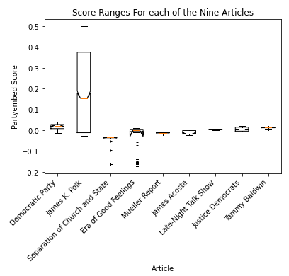

# Politics on Wikipedia
_An exploration of political slant in Wikipedia articles_

## Background

The ubiquity of Wikipedia and the current salience of politics encouraged us to study their impact on Wikipedia. Pew research has found that in the United States, political division is [increasing, and is most present among the most politically active](https://www.pewresearch.org/politics/2014/06/12/section-1-growing-ideological-consistency/). 

Wikipedia is an incredibly popular encyclopedia that is often considered a completely neutral and trustworthy source of information, while simultaneously having the most chaotic data generation process in the history of encyclopedias. Exploring the ways in which Wikipedia’s crowd-sourced approach may fail, therefore, is not only very interesting, but also extremely crucial in this day and age when information is so important and misinformation is so dangerous.

Among many different forms of misinformation, political and ideological biases are, arguably, the most harmful. Researchers have dug into this topic before, using a variety of strategies to analyze bias. Here, we decided to take a look at a few of these strategies and compare their results, in an effort to find out the strengths of these different strategies and perhaps find locations where one strategy is more effective than another.

## Models

### _Data_

Both of our models are initially trained on congressional data. The speeches are readily associated with their political stance, and there is plenty of data to be used.

After training, our models were then validated on the Ideological Books Corpus (Sim et al., 2013) with sub-sentential annotations (Iyyer et al., 2014). This set is much smaller, but its strength comes in that it is clearly labeled with ideological position, and is *not* congressional in nature (instead sourced from books and magazines).

In doing this, we can find that the models are not limited to detecting bias in congressional material, but can generalize to broader ranges of text documents.

With these models in hand, we downloaded current pages and revision histories of political articles from Wikipedia, as it is on these documents that we intend to run these models.

### _Partyembed Model_

The partyembed model was designed by Rheault and Cochrane, effectively finding the ideological placement of congressional documents. The full paper is linked below:

Ludovic Rheault and Christopher Cochrane. 2020. [Word Embeddings for the Analysis of Ideological Placement in Parliamentary Corpora](https://ludovicrheault.weebly.com/uploads/3/9/4/0/39408253/rheaultcochrane2019_pa.pdf). Political Analysis 28(1): 112-133.

From their pre-trained models, we used one trained on United States House data. There, for any given word in the model's vocabulary, we were able to discover its overall political leanings with respect to any particular congressional year/party combination.

### _Gentzkow and Shapiro Model_

This model was developed by Matthew Gentzkow, Jesse Shapiro, and Matt Taddy as part of their research into the polarization of american speech. The model, based on Matt Taddy’s previous research into language processing, assigns scores to two-word phrases based on the frequency of usage of those phrases by left- and right-leaning speakers in congress. The sign of the score is indicative of left (negative) versus right (positive) bias, and the magnitude of the score represents the extent of the bias. For example, “agricultur interest” with the score of -0.039874 is a slightly liberal, almost neutral phrase, while “american peopl” with the score of 499.125580 is an extremely conservative phrase.

### Further details of the models

[Click here to learn more](further-details.md)

## Results

### _Model Validity_

On the one hand, the results we got from testing our models on the IBC data were quite promising: our models performed inaccurately on individual sentences, but once we started testing on combinations of sentences the accuracy shot up significantly. This gives us a lot more faith in our models since we know Wikipedia articles consist of many sentences.
On the other hand, the correlation between Wikipedia scores from the two models is quite weak. While this does not immediately mean that the models are not working properly, it is still a sign of methodological inconsistency which is something that can be explored further in the future.

### _Model Results_

#### _Current Pages_

The results of the two models were moderately correlated at 0.285213, with relatively normally distributed differences

The differences weren’t entirely random, luckily. Articles with the most contention were predominantly those of politicians and other individuals

However, here we were most interested in the most politically slanted articles identified by each model.

For the most left-leaning articles identified by the partyembed model, it made us quite concerned over whether or not our aforementioned strategy was effective in avoiding our models acting as a topic detector. These articles were heavily centered around left-leaning topics, such as the article for “Civil rights movement” and “New Deal coalition”. While this could possibly mean that these articles were in fact written with a left-leaning slant, it could also mean our article could not avoid being a topic detector when it is applied to these particular kinds of Wikipedia articles.

As for the right-leaning articles, the partyembed model identified interesting choices. For instance, although our method for applying the partyembed model to Wikipedia articles used data from 2007 onwards, it consistently identified articles relating to Trump and Russia, data only relevant for the very end of the data selection. What’s more, it is quite likely that democrats too were talking about the Mueller investigation, etc. So these results were particularly perplexing.

Another interesting result within the right-leaning articles (though not the most right-leaning articles) was the prevalence of conspiracy-related articles. All but one of the articles relating to conspiracies that we found (the exception pertaining to conspiracy theories relating to the assassination of Robert F. Kennedy) each had a right-leaning slant. What’s more is that the majority of these right-leaning slants were not mild, but many were quite noticeably towards the right-wing end. Also, these articles were not all about right-wing conspiracy theories, but included relatively non-partisan theories such as the New World Order.

We’re hesitant to make drastic claims about the world from these results, what we might conclude is that the language being used in these Wikipedia articles is similar to that being used by republican congresspeople.

For the left-leaning articles identified by the Shapiro & Gentzkow model, the current pages revealed many articles centered around people. As there seems to be less representation of left-wing topics within these topmost articles, one could perhaps take away that the S&G approach is more able to avoid topic detection within the most left-wing articles. However, more research would be needed to make sure of this.

On the other hand, the most right-wing articles were more of a mix. Like partyembed, the topmost right-wing articles did include a number of articles pertaining to Trump and Russia, like the articles for Mueller report and Michael Flynn. However, there was also a lower representation of articles pertaining to right-wing topics. While the former included articles such as “Bible belt,” “Flags of the Confederate States of America,” “Taxation in the United States,”, “Jefferson Davis,”, and “Barack Obama Religion Conspiracy Theories”, the latter included far fewer articles such as “Newsmax,” “Donald Trump 2016 presidential campaign.” With this common trend in both left and right wing, one could possibly take away the message that the Gentzkow & Shapiro approach performs slightly better at avoiding topic detection overall. But as to why this is, it is still difficult to say— after all, both use the same data

#### _Revision History_

Overall, associations between the two models for revision histories was positive, but quite modest. We can interpret this as being due to the two models using different weights for different words— while the final outcomes may be moderately correlated, the paths they use to get there can be quite different.

One noticeable trend was that for the majority of articles, (Jim Acosta and Democratic Party being the only two exceptions) the majority of the variation in an article’s bias rating was typically found at the very beginning of its lifespan. One of the more drastic examples of these (Mueller Report) can be found below.

This makes sense intuitively, if article lengths generally increase over their lifespan, slanted edits of around the same size will typically have less and less of an impact as time goes on.

Another finding we found was the “stair step” movements of the various plots. We assume that these are the results of large chunks of the article being added or taken away.

Another object of interest to us was the varying ranges of scores over time— if these ranges were similar, or different in some pattern, etc. In general, we found that the range of scores given to an article over its span varied wildly

When looking that the ranges for the scores of each of the articles in question, the articles with the largest variation in scores were in fact so large as to obscure the matterns in any of the smaller ranges, as seen above.

When analyzing the score ranges that seemed closer together (that is, after dropping the three articles with the highest variation, “James K. Polk,” “Separation of Church and State,” and “The Era of Good Feelings”), we found that even then, the ranges in scores varied substantially.

	
Overall, the variation does not seem to be related to the overall slant or the size of the article— both the biggest culprits in variation and the smallest both had assortments of short/long/neutral and democratic/neutral/republican articles.

## Conclusion

